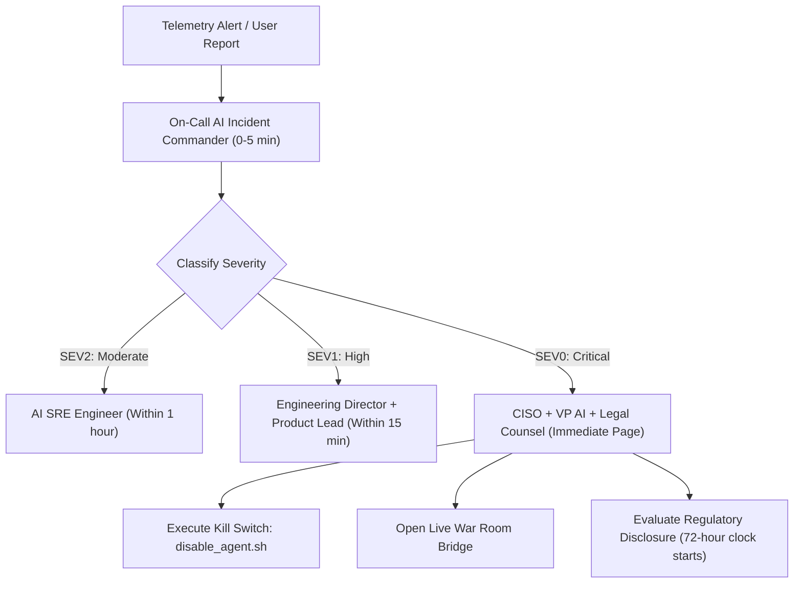

# AI Incident Escalation Tree

```mermaid
graph TD
    ALERT["Telemetry Alert / User Report"] --> TRIAGE["On-Call AI Incident Commander (0-5 min)"]
    TRIAGE --> Q_SEV{"Classify Severity"}
    
    Q_SEV -->|SEV2: Moderate| ENG["AI SRE Engineer (Within 1 hour)"]
    Q_SEV -->|SEV1: High| S1["Engineering Director + Product Lead (Within 15 min)"]
    Q_SEV -->|SEV0: Critical| S0["CISO + VP AI + Legal Counsel (Immediate Page)"]
    
    S0 --> KILL["Execute Kill Switch: disable_agent.sh"]
    S0 --> WAR["Open Live War Room Bridge"]
    S0 --> REG["Evaluate Regulatory Disclosure (72-hour clock starts)"]
```
