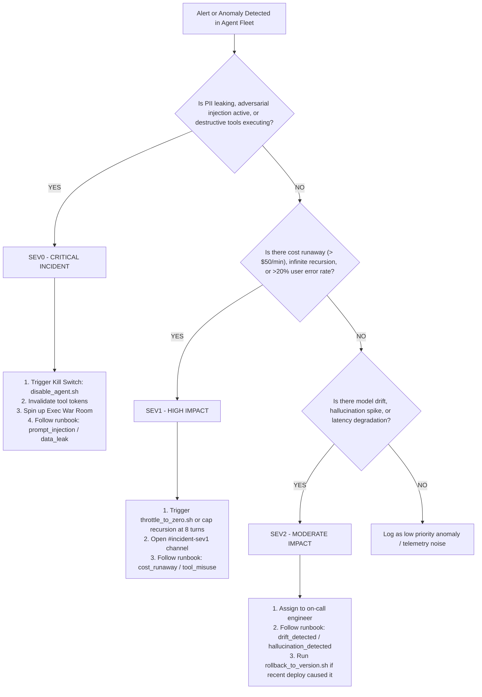

# AI Agent Incident Triage Decision Tree

```mermaid
flowchart TD
    START["Alert or Anomaly Detected in Agent Fleet"] --> Q1{"Is PII leaking, adversarial injection active, or destructive tools executing?"}
    
    Q1 -- YES --> SEV0["SEV0 - CRITICAL INCIDENT"]
    SEV0 --> ACT0["1. Trigger Kill Switch: disable_agent.sh\n2. Invalidate tool tokens\n3. Spin up Exec War Room\n4. Follow runbook: prompt_injection / data_leak"]
    
    Q1 -- NO --> Q2{"Is there cost runaway (> $50/min), infinite recursion, or >20% user error rate?"}
    
    Q2 -- YES --> SEV1["SEV1 - HIGH IMPACT"]
    SEV1 --> ACT1["1. Trigger throttle_to_zero.sh or cap recursion at 8 turns\n2. Open #incident-sev1 channel\n3. Follow runbook: cost_runaway / tool_misuse"]
    
    Q2 -- NO --> Q3{"Is there model drift, hallucination spike, or latency degradation?"}
    
    Q3 -- YES --> SEV2["SEV2 - MODERATE IMPACT"]
    SEV2 --> ACT2["1. Assign to on-call engineer\n2. Follow runbook: drift_detected / hallucination_detected\n3. Run rollback_to_version.sh if recent deploy caused it"]
    
    Q3 -- NO --> LOG["Log as low priority anomaly / telemetry noise"]
```
